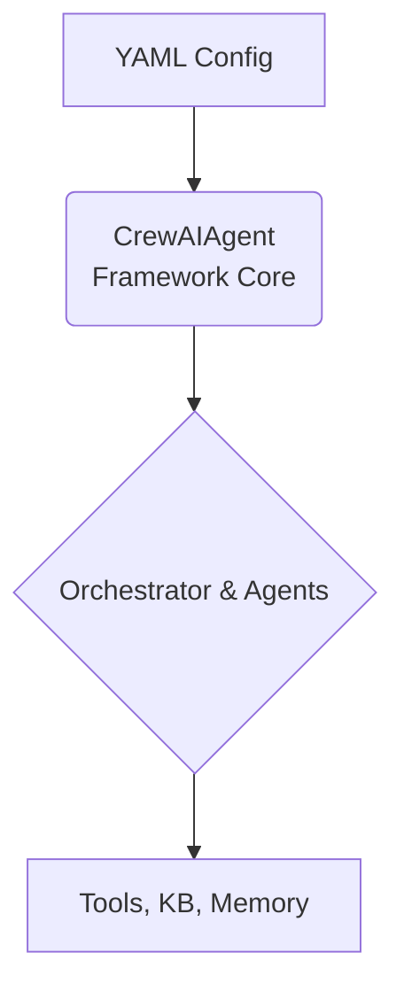

# Overview

The CrewAI Multi-Agent Framework enables you to create sophisticated agent orchestrations through simple YAML configuration files. Built on CrewAI and LangChain, it provides a declarative way to define multi-agent systems with support for various orchestration patterns.

## High-Level Architecture

The framework operates on a simple principle: your YAML configuration is the single source of truth that defines the entire system. The `CrewAIAgent` class reads this configuration and dynamically constructs the agent or team of agents at runtime.

## What Can You Build?

- Research and analysis pipelines with agent handoffs
- Complex decision-making systems with multiple specialists
- Data processing workflows with parallel execution
- Autonomous agent systems with dynamic collaboration
- Enterprise-grade AI applications
