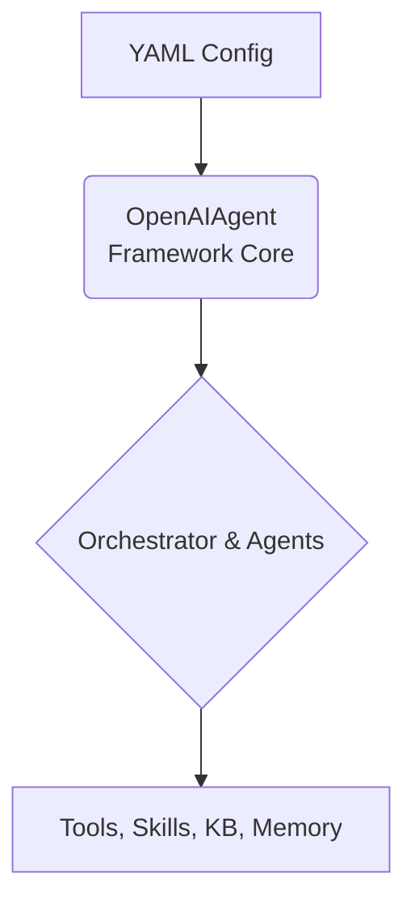

# Overview

The OpenAI Multi-Agent Framework enables you to create sophisticated agent orchestrations using OpenAI's models through simple YAML configuration files. It provides a declarative way to define multi-agent systems with support for various orchestration patterns, tool integration, and memory management.

## High-Level Architecture

The framework operates on a simple principle: your YAML configuration is the single source of truth that defines the entire system. The `OpenAIAgent` class reads this configuration and dynamically constructs the agent or team of agents at runtime.

## What Can You Build?

- Research and analysis pipelines with agent handoffs
- Complex decision-making systems with multiple specialists
- Data processing workflows with parallel execution
- Autonomous agent systems with dynamic collaboration
- Enterprise-grade AI applications
