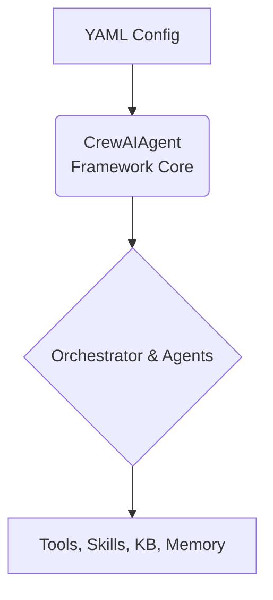

# CrewAI Multi-Agent Framework

A powerful, YAML-based configuration system for building multi-agent AI workflows with CrewAI and LangChain. Build complex agent orchestrations without writing code—just configure and run.

## Table of Contents

- [Overview](#overview)
- [Prerequisites](#prerequisites)
- [Quick Start](#quick-start)
- [Project Structure](#project-structure)
- [Key Features](#key-features)
- [Configuration](#configuration)
- [Orchestration Patterns](#orchestration-patterns)
- [Agents and Tasks](#agents-and-tasks)
- [Tools System](#tools-system)
- [Agent Skills](#agent-skills)
- [Structured Output](#structured-output)
- [Knowledge Base Integration](#knowledge-base-integration)
- [Data Sources](#data-sources)
- [Memory Management](#memory-management)
- [MCP Integration](#mcp-integration)
- [Guardrails Integration](#guardrails-integration)
- [Dynamic Input Variables](#dynamic-input-variables)
- [Usage Examples](#usage-examples)
- [Streaming Support](#streaming-support)
- [Observability](#observability)
- [Best Practices](#best-practices)
- [Troubleshooting](#troubleshooting)
- [API Reference](#api-reference)

## Overview

The CrewAI Multi-Agent Framework enables you to create sophisticated agent orchestrations through simple YAML configuration files. Built on CrewAI and LangChain, it provides a declarative way to define multi-agent systems with support for various orchestration patterns.

### High-Level Architecture

The framework operates on a simple principle: your YAML configuration is the single source of truth that defines the entire system. The `CrewAIAgent` class reads this configuration and dynamically constructs the agent or team of agents at runtime.



### What Can You Build?

- Research and analysis pipelines with agent handoffs
- Complex decision-making systems with multiple specialists
- Data processing workflows with parallel execution
- Autonomous agent systems with dynamic collaboration
- Enterprise-grade AI applications

## Prerequisites

Before running the agent, ensure you have the necessary API keys set as environment variables based on your chosen `cloud_provider`:

```bash
# For OpenAI models
export OPENAI_API_KEY="sk-..."

# For Anthropic models
export ANTHROPIC_API_KEY="sk-ant-..."

# For AWS Bedrock
export AWS_ACCESS_KEY_ID="..."
export AWS_SECRET_ACCESS_KEY="..."
export AWS_DEFAULT_REGION="us-west-2"
```

You must also install the specific LangChain provider package for the model you intend to use:

```bash
pip install langchain-openai      # If using cloud_provider: openai
pip install langchain-anthropic   # If using cloud_provider: anthropic
pip install langchain-aws         # If using cloud_provider: aws
```

## Quick Start

There are two ways to get started: using the interactive project generator for a guided setup, or manually configuring your project.

### Option 1: Use the Project Generator (Recommended)

The `oai-gen` CLI tool scaffolds a complete, production-ready project with all the necessary configurations, including multi-agent setups, knowledge bases, and more.

**1. Install the Generator**

First, install the template generator tool:
```bash
mkdir agent_development
cd agent_development
python3.13 -m venv .venv
source .venv/bin/activate
pip install uv

uv pip install 'oai-template-generator @ git+https://github.com/Capgemini-Innersource/ptr_oai_agent_development_kit@main#subdirectory=packages/template-generator'
```

**2. Create a New Agent Project**

Run the interactive wizard to create a new agent. It will guide you through selecting the framework, orchestration pattern, models, tools, and other settings.
```bash
oai-gen new agent
```
Or provide arguments directly to skip initial prompts:

```bash
oai-gen new agent my_agent_project --author "Jane Doe" --email "jane.doe@capgemini.com"
```


The wizard will ask you to choose a framework. Select **CrewAI**. It will then generate a complete project structure, including a pre-filled YAML configuration file, ready for you to customize and run.

### Knowledge Base (RAG)
You can configure knowledge bases at both the **Global** (shared) and **Agent** levels. Supported backends:
- **Chroma**: Local vector store.
- **Postgres**: Connection placeholders for pgvector.
- **S3**: Bucket and region placeholders.

### MCP Servers
When adding MCPs to an agent, you can specify the type:
- **`stdio`**: For local command-line servers. The config will include `command`, `args`, and `env`.
- **`remote`**: For servers accessible via HTTP. The config will include `url` and `headers`.

### Guardrails
If enabled, a `guardrails` section is added to your agent config with sample validators like `competitor_check`, `DetectPII`, and `profanity_free`.

### Getting Started & Next Steps

The template generator automatically initializes a Git repository and creates a Python virtual environment (`.venv`) for you.

To get started with your new project, follow these steps:

1.  **Navigate into your project directory:**
    ```bash
    cd <your_project_name>
    ```

2.  **Activate the virtual environment:**
    ```bash
    source .venv/bin/activate
    ```
    *(On Windows, use `.venv\Scripts\activate`)*

3.  **Install `uv`, a high-performance package manager:**
    ```bash
    pip install uv
    ```

4.  **Install project dependencies using `uv`:**
    ```bash
    uv pip install -r requirements.txt
    ```

5.  **(Optional) Add More Dependencies:**
    If your project requires additional packages, add them to `pyproject.toml` and/or `requirements.txt`, then re-run the install command.

6.  **Review Your Configuration:**
    Open the generated `.../agents_config/<agent_name>.yaml` or `.../servers_config/<server_name>.yaml` file and review the settings, updating them as necessary for your specific use case.

### Option 2: Manual Setup

If you prefer to build your project from scratch, follow these steps.

**1. Installation**

```bash
pip install oai-crewai-agent-core
```

To install with specific optional dependencies:

```bash
# For vector store support (required for any vector DB)
pip install "oai-crewai-agent-core[vector-required]"

# For ChromaDB support
pip install "oai-crewai-agent-core[chromadb]"

# For Postgres (pgvector) support
pip install "oai-crewai-agent-core[postgres]"

# For S3 vector store support
pip install "oai-crewai-agent-core[s3]"

# For all features
pip install "oai-crewai-agent-core[all]"
```

**2. Create Your Configuration File**

Create a YAML file (e.g., `research_agent.yaml`):

```yaml
model:
  model_id: gpt-4o
  cloud_provider: openai

tools:
  calculator:
    module: langchain_community.tools
    class: Calculator

agent_list:
  - researcher:
      role: "Researcher"
      goal: "Research topics and gather information"
      backstory: "You are an expert researcher."
      tools:
        - calculator
  - analyst:
      role: "Analyst"
      goal: "Analyze information and identify key insights"
      backstory: "You are a data analyst."

task_list:
  - research_task:
      description: "Research the latest trends in {topic}."
      expected_output: "A summary of the top 5 trends."
      agent: "researcher"
  - analysis_task:
      description: "Analyze the research findings and provide a report."
      expected_output: "A detailed analysis report with charts."
      agent: "analyst"
      context:
        - "research_task"

crew_config:
  process: "sequential"
```

**3. Initialize and Run**

```python
import yaml
from oai_crewai_agent_core.agents.crewai_agent import CrewAIAgent

# Load configuration
with open("research_agent.yaml", "r") as f:
    config = yaml.safe_load(f)

agent = CrewAIAgent(
    agent_name="research_crew",
    agent_config=config
)

# Initialize
await agent.initialize()

# Execute
result = await agent.ainvoke({"topic": "Quantum Computing"})
print(result)
```

## Project Structure

When you use the `oai-gen` tool to create a new CrewAI agent project, it generates a standardized, production-ready directory structure. This ensures consistency and makes it easy to locate and manage different parts of your agent.

Here is the typical structure of a generated project:

```text
ptr_agent_servers_my_project/
├── agentic_registry_agents/
│   ├── agents/
│   │   └── my_agent/
│   │       ├── agent.py
│   │       └── server.py
│   ├── agents_config/
│   │   └── my_agent.yaml      # Full configuration (Model, Tools, KB, etc.)
│   └── utils/
│       └── my_agent_utils.py  # Scaffolded tool functions
├── .gitignore
├── docker-compose.yaml          # Docker Compose file for containerization
├── Makefile
├── Dockerfile
├── pyproject.toml               # Project metadata and dependencies
├── README.md
└── tests/                       # Unit and integration tests
```

### Key Directories and Files

-   **`ptr_agent_servers_{agent_name}/`**: The main source code directory for your agent package.
-   **`agents/my_agent/agent.py`**: This is where the core `CrewAIAgent` class is instantiated. You typically don't need to modify this file unless you are customizing the agent's fundamental behavior.
-   **`agents/my_agent/server.py`**: A pre-configured FastAPI server that exposes your agent's endpoints, enabling it to be used as a microservice.
-   **`agents_config/my_agent.yaml`**: The heart of your project. This YAML file is where you define everything about your agent—its model, tools, knowledge base, memory, and orchestration patterns.
-   **`global_config/`**: Contains default model parameters for different cloud providers. The settings here are automatically merged with your agent's configuration.
-   **`utils/my_agent_utils.py`**: If you define custom tools, this is where you'll write the Python functions that implement their logic.
-   **`pyproject.toml`**: Managed by Poetry, this file lists all project dependencies. The generator automatically adds the required packages based on your framework and feature selections.
-   **`docker-compose.yaml`**: Allows you to run your agent and any dependent services (like a Postgres database for memory) in containers.

## Key Features

### 🤖 CrewAI Native Integration
Built on the robust CrewAI framework, leveraging its powerful agent and task orchestration capabilities.

### 🔄 Flexible Orchestration
Support for both sequential and hierarchical process patterns to fit your workflow needs.

### 🛠️ Extensible Tools System
Integrate LangChain community tools, custom tools, and MCP servers seamlessly.

### 🎯 Agent Skills
Group sets of related prompts, instructions, and workflows into reusable "skills" to modularize agent behavior. Support adding resources and scripts to skills for advanced workflows.

### 📝 Structured Output
Define the output structure using Pydantic models to get predictable, machine-readable results from your agents.

### 📚 Knowledge Base Support
Easily integrate custom knowledge bases (RAG) for agents to access domain-specific information.

### 🧠 Long-Term Memory
Persistent memory store for maintaining context across sessions with semantic search capabilities.

### 🔌 MCP Server Support
Connect to Model Context Protocol servers for enhanced capabilities.

### 🛡️ Guardrails Integration
Validate and sanitize both input and output using built-in or custom validators.

### 📊 Session Management
Built-in session tracking and output serialization for conversation continuity.

### 📈 Observability with Langfuse
Optional Langfuse integration for tracing, monitoring, and debugging.

### ⚡ Streaming Support
Real-time streaming of agent outputs and task handoffs.

## Configuration

The entire behavior of your agent is defined in a single, powerful YAML file. This declarative approach allows you to build and modify complex agent systems without writing extensive boilerplate code.

### Minimal Example

For a simple, single-agent system, your configuration can be very concise.

```yaml
# 1. Define the model
model:
  model_id: "gpt-4o"
  cloud_provider: "openai"

# 2. Define the agent
agent_list:
  - researcher:
      role: "Researcher"
      goal: "Research topics"
      backstory: "An expert researcher."

# 3. Define the task
task_list:
  - research_task:
      description: "Research the topic: {topic}"
      expected_output: "A summary of the topic."
      agent: "researcher"
```

### Complete YAML Template

This template shows all the possible configuration options available. You can mix and match sections based on your needs.

```yaml
# 1. Model Configuration: Defines the LLM to be used.
model:
  model_id: "gpt-4o"
  cloud_provider: "openai" # Options: openai, anthropic, aws, etc.
  params:  # Optional: Override default model parameters
    temperature: 0.7
    max_tokens: 4096

# 2. Crew Configuration: Defines the multi-agent process.
crew_config:
  process: "sequential" # or "hierarchical"
  manager_llm: "gpt-4o" # Optional: Specify a different model for the manager in hierarchical mode.

# 3. Tools Definition: A global registry of tools available to agents.
tools:
  my_tool:
    module: "my_tool_module"
    class: "MyToolClass"

# 4. Skills Definition: A global registry of skills available to agents.
skills:
  skill_dir: "./skills"

# 5. Structured Output: Defines the Pydantic models for structured responses.
structured_output:
  script_dir: "./structured_output"

# 6. Knowledge Base: Provides documents for Retrieval-Augmented Generation (RAG).
knowledge_base:
  - name: "company_docs"
    description: "Search company policies and internal procedures."
    vector_store:
      type: "chroma"
      settings:
        collection_name: "company_docs_collection"
        persist_directory: "./rag_db"
    data_sources:
      - type: "file"
        path: "docs/policy.pdf"

# 7. Memory: Enables the agent to remember past conversations.
memory:
  vector_store:
    type: "chroma"
    settings:
      collection_name: "chat_memory"
      persist_directory: "./memory_db"
  settings:
    max_recent_turns: 5
    max_relevant_turns: 3

# 8. MCP Servers: Connects to external tools via the Model Context Protocol.
mcps:
  filesystem_server:
    command: "mcp-server-filesystem"
    args: ["/data"]

# 9. Guardrails: Adds input and output validation.
guardrails:
  validators:
    - name: "profanity_check"
      full_name: "guardrails/profanity_free"
      on_fail: "fix"
  output:
    validators:
      - ref: "profanity_check"

# 10. Agent Definitions: The list of agents in the system.
agent_list:
  - researcher:
      role: "Researcher"
      goal: "To find the most relevant and up-to-date information."
      backstory: "An expert in web scraping and data collection."
      tools: ["my_tool"] # Assign tools from the global registry.
      skills: ["my_skill"] # Assign skills from the global registry.
      knowledge_base: ["company_docs"] # Assign a knowledge base.

# 11. Task Definitions: The list of tasks to be executed by the agents.
task_list:
  - research_task:
      description: "Research the impact of AI on the job market."
      expected_output: "A detailed report summarizing the key findings."
      agent: "researcher"
      context: [] # Optional: List of other task keys this task depends on.
      structured_output_model: "MyOutputModel" # Optional: Specify a Pydantic model for structured output.
```

## Orchestration Patterns

### 1. Sequential Process

**When to use:** For workflows where tasks must be executed in a specific, linear order. Each task is completed before the next one begins.

```yaml
crew_config:
  process: sequential
```

### 2. Hierarchical Process

**When to use:** For complex workflows that require a manager to coordinate the work of other agents. The manager agent breaks down the problem, delegates tasks, and synthesizes the final output.

```yaml
crew_config:
  process: hierarchical
  manager_llm: gpt-4o # Optional: Use a more powerful model for the manager.
```

## Agents and Tasks

In CrewAI, the system is defined by **Agents** (the workers) and **Tasks** (the work to be done).

### Agent Properties

Each agent is defined by its role, goal, and backstory, which helps the LLM understand its purpose.

```yaml
agent_list:
  - researcher:
      role: "Expert Research Analyst"
      goal: "Uncover cutting-edge developments in AI and data science."
      backstory: "You are a renowned researcher with a knack for finding hidden gems of information."
      tools: [web_search] # Assign specific tools to this agent.
      skills: [skill_name] # Optional: list of skills available to the agent
```

### Task Properties

Each task defines a unit of work, what is expected as an output, and which agent should perform it.

```yaml
task_list:
  - research_task:
      description: "Investigate the latest advancements in AI for financial forecasting."
      expected_output: "A comprehensive report with at least 5 key findings and their potential impact."
      agent: "researcher"
      context: [] # This task has no dependencies.
      structured_output_model: "MyOutputModel" # Optional: Pydantic model for structured output

  - writing_task:
      description: "Write a blog post based on the research findings."
      expected_output: "An engaging 500-word blog post."
      agent: "writer"
      context: [research_task] # This task depends on the output of the research_task.
```

## Tools System

### Defining Tools

#### Load Class-Based Tools (LangChain Community)

```yaml
tools:
  web_search:
    module: langchain_community.tools
    class: DuckDuckGoSearchRun
```

#### Load Custom Module Tools

```yaml
tools:
  my_custom_tool:
    module: my_tools
    function_list:
      - my_function
    base_path: ./src
```

### Setting Default Parameter Values

You can configure default parameter values for tool functions using the `function_params` field.

```yaml
tools:
  random_generator:
    module: random_generator
    function_params:
      generate_random_number:
        lower: 10
        upper: 100
```

## Agent Skills

Agent Skills provide a way to modularize complex behaviors, workflows, and prompts into reusable components. Think of a "skill" as a predefined set of instructions and patterns that teach an agent *how* to perform a specific kind of complex task, such as processing a file, writing a specific type of code, or conducting a specialized analysis.

Instead of writing a massive, complicated system prompt for every agent, you can write concise system prompts and attach pre-built skills.

For more detailed information, best practices, and advanced skill creation, please refer to the [Agent Skills Documentation](https://agentskills.io/skill-creation/quickstart).

### How Skills Work

1.  **Skill Directory**: You define a directory in your project that will contain your skills.
2.  **Skill Folders**: Inside this directory, each skill gets its own folder (e.g., `file-processing`).
    *   **Resources and Scripts**: You can also add additional resources, Python scripts, or data files inside the skill folder to support the skill's execution.
3.  **`SKILL.md` File**: The core of a skill is its `SKILL.md` file. This Markdown file serves as a comprehensive instruction manual for the agent. It contains:
    *   **YAML Frontmatter**: Metadata like the skill's name, description, and the names of any tools it depends on.
    *   **Purpose & Capabilities**: Plain English descriptions of what the skill does.
    *   **Execution Instructions**: Step-by-step guidance for the agent on how to use the skill.
    *   **Examples & Patterns**: Code snippets and common use cases the agent can follow or adapt.
4.  **Agent Integration**: You attach skills to specific agents in your main YAML configuration. The framework automatically reads the `SKILL.md` files and injects their contents into the agent's context, effectively teaching it the skill.

### Incorporating Skills into Your Agent

**Step 1: Set up the Skill Directory**

Create a folder to hold your skills. A common location is a `skills` folder at the root of your project or next to your agent configuration.

```bash
mkdir skills
mkdir skills/file-processing
touch skills/file-processing/SKILL.md
```

**Step 2: Create a `SKILL.md` File and Add Resources**

Write the instructions for your skill. The file *must* contain YAML frontmatter with at least the `name` and `description`. You can optionally add scripts or other resources alongside the `SKILL.md` file.

*Example: `skills/file-processing/SKILL.md`*

```markdown
---
name: file-processing
description: Process and analyze CSV, JSON, and text files.
allowed-tools:
  - shell
---

# File Processing Skill

## Purpose
Process structured data files with comprehensive capabilities for data cleaning and transformation.

## Instructions
1. Understand the user's requested analysis.
2. Use the `shell` tool to write Python scripts that read the target files (e.g., using `csv` or `json` modules) or use the provided scripts.
3. Apply the requested transformations (filtering, sorting).
4. Format the output as a Markdown table.

## Common Use Cases
### CSV Analysis
```python
import csv
with open('data.csv', 'r') as f:
    reader = csv.DictReader(f)
    # ... process data ...
```

## Supporting Scripts
- `scripts/process.py`: Utility functions for processing data. Use this script for complex transformations.
```

**Step 3: Update Your Agent Configuration**

In your main agent YAML file (e.g., `my_agent.yaml`), do two things:

1.  **Define the Global `skill_dir`**: Tell the framework where to find the skills.
2.  **Assign Skills to Agents**: Add the `skills` list to any agent that needs them.

```yaml
model:
  model_id: "gpt-4o"
  cloud_provider: "openai"

# 1. Tell the framework where your skills are located
skills:
  skill_dir: "./skills"

agent_list:
  - data_assistant:
      role: "Data Assistant"
      goal: "Assist with data-related tasks."
      backstory: "A helpful assistant specialized in data tasks."
      # 2. Assign the skill to the agent
      skills:
        - file-processing
```

When the `data_assistant` agent runs, it will now have all the knowledge and instructions defined in `skills/file-processing/SKILL.md` added to its prompt.

## Structured Output

Ensure your agent's responses are predictable and machine-readable by defining a structured output format. This is useful when you need the agent to return data that can be programmatically processed, such as JSON with a specific schema.

### How It Works

1.  **Define a Pydantic Model**: Create a Python file containing a Pydantic model. This model defines the exact schema (fields, types, and descriptions) of the output you expect from the agent.
2.  **Configure the `structured_output` Directory**: In your main YAML configuration, specify the directory where your Pydantic models are located.
3.  **Assign the Model to a Task**: In the `task_list`, add the `structured_output_model` property to the desired task and set its value to the name of your Pydantic class.

When the task is executed, the framework instructs the LLM to format its response according to the provided Pydantic model, ensuring the output is a valid, structured object.

### Example Implementation

**Step 1: Create a Pydantic Model**

Create a Python file (e.g., `structured_output/models.py`) and define your Pydantic model.

*Example: `structured_output/models.py`*
```python
from pydantic import BaseModel, Field

class EmailAnalysis(BaseModel):
    """
    Represents the structured analysis of an email's content.
    """
    summary: str = Field(description="A concise, one-line summary of the email's main topic.")
    requires_urgent_response: bool = Field(description="True if the email requires an immediate response.")
    sentiment: str = Field(description="The email's sentiment. Must be 'positive', 'negative', or 'neutral'.", enum=['positive', 'negative', 'neutral'])
```

**Step 2: Update Your Agent Configuration**

In your main YAML file, configure the `structured_output` directory and assign the model to your task.

```yaml
model:
  model_id: "gpt-4o"
  cloud_provider: "openai"

# 1. Tell the framework where your Pydantic models are located
structured_output:
  script_dir: "./structured_output"

agent_list:
  - email_analyzer:
      role: "Email Analyzer"
      goal: "Analyze an email and provide a structured summary."
      backstory: "An expert in email analysis."

task_list:
  - analysis_task:
      description: "Analyze the following email."
      expected_output: "A structured summary of the email."
      agent: "email_analyzer"
      # 2. Assign the Pydantic model to the task
      structured_output_model: "EmailAnalysis"
```

Now, when the `analysis_task` is executed, its output will be a JSON object that conforms to the `EmailAnalysis` model's schema.

## Knowledge Base Integration

Give your agents access to custom information by setting up a knowledge base. This allows them to answer questions about specific documents or data you provide.

### How It Works

1.  **You provide documents**: Point the system to local files, S3 buckets, or even dynamically load from any LangChain-supported document loader.
2.  **Indexing**: The system reads, splits, and stores the content in a vector database, making it searchable.
3.  **Retrieval**: When a user asks a question, the system finds the most relevant information from the knowledge base.
4.  **Answering**: This information is given to the agent, who uses it to form a complete and accurate answer.

### Configuration Explained

Here’s a breakdown of the settings you can use to configure a knowledge base.

```yaml
knowledge_base:
  - name: "company_policies_kb"
    description: "Use this to answer questions about our company's HR policies and internal procedures."
    
    # --- Where to store the indexed data ---
    vector_store:
      type: "chroma"  # The database type. "chroma" is great for local use.
      settings:
        collection_name: "company_policies"
        persist_directory: "./rag_db"  # Folder to save the database on your computer.

    # --- How to understand your documents ---
    embedding:
      model_id: "bedrock/amazon.titan-embed-text-v1" # The AI model that converts text into searchable vectors.
      region_name: "us-west-2" # Required for some cloud providers like AWS.

    # --- Where to find your documents ---
    data_sources:
      - type: "file"
        path: "docs/hr_policy.pdf" # A local file.
      - type: "s3"
        bucket: "my-company-docs" # An AWS S3 bucket.
        prefix: "policies/" # A specific folder within the bucket.

    # --- How to break down your documents ---
    text_splitter:
      type: "recursive_character" # A smart way to split text while keeping sentences together.
      chunk_size: 1000 # The maximum size of each text chunk (in characters).
      chunk_overlap: 200 # How many characters to overlap between chunks to maintain context.

    # --- How to search for information ---
    retrieval_settings:
      top_k: 5 # The number of relevant chunks to retrieve for a given question.
      score_threshold: 0.7 # Only return chunks with a similarity score above this value (0.0 to 1.0).
```

### Vector Store Options

You can choose from several types of vector stores to save your indexed data.

#### 1. ChromaDB (Default)
**Best for:** Local development and quick setups.
```yaml
vector_store:
  type: chroma
  settings:
    collection_name: "my_local_kb"
    persist_directory: "./data/chroma_db"
```

#### 2. Postgres (using `pgvector`)
**Best for:** Production systems that already use PostgreSQL.
```yaml
vector_store:
  type: postgres
  settings:
    collection_name: "my_production_kb"
    db_host: "localhost"
    db_port: "5432"
    db_user: "myuser"
    db_name: "mydatabase"
    # IMPORTANT: Do not write your password here.
    # Set it as an environment variable: DB_PASSWORD_MYDATABASE
```

#### 3. S3 (Simple, Serverless)
**Best for:** Read-heavy use cases where you want a lightweight, cloud-based solution without managing a database.
```yaml
vector_store:
  type: s3
  settings:
    collection_name: "my_s3_kb"
    bucket_name: "my-vector-data-bucket"
    prefix: "indexes/" # Optional folder inside the bucket.
```

### Two Ways to Use a Knowledge Base

#### 1. Global Knowledge Base
A global knowledge base is automatically searched for every user query. The relevant context is added to the prompt before the agent sees it. This is useful for providing general context that should always be available.

```yaml
# This knowledge base will be used for all agents
knowledge_base:
  - name: "company_wide_info"
    # ... other settings ...
```

#### 2. Agent-Specific Knowledge Base (as a Tool)
You can also give a knowledge base to a specific agent as a tool. This lets the agent decide *when* to search for information, which is more efficient for specialized tasks.

```yaml
agent_list:
  - policy_expert:
      role: "Policy Expert"
      goal: "Answer questions about company policies."
      backstory: "An expert on the company handbook."
      knowledge_base:
        - name: "company_policies_kb"
          description: "Search for company policies and procedures."
          # ... other settings ...
```

## Data Sources

The framework supports loading data from various sources to ground your agents.

### Supported Sources

1.  **Local Files**: Load documents directly from the file system.
2.  **S3 Buckets**: Download and sync documents from AWS S3 buckets.
3.  **Any LangChain Document Loader**: Dynamically load data from any document loader available in the LangChain ecosystem. You can provide the full class path or just the class name.

### Configuration Example

```yaml
knowledge_base:
  - name: "my_knowledge_base"
    data_sources:
      # 1. Local File Source
      - type: "file"
        path: "/path/to/local/documents/*.pdf"
        chunk_size: 1000
        chunk_overlap: 200

      # 2. S3 Bucket Source
      - type: "s3"
        bucket: "my-company-docs-bucket"
        prefix: "manuals/"  # Optional: specific folder
        # Files are downloaded to {persist_directory}/s3_bucket/{bucket_name}/...

      # 3. Dynamic LangChain Loader (e.g., Confluence)
      # You can provide the full class path
      - loader: "langchain_community.document_loaders.ConfluenceLoader"
        settings:
          url: "https://your-company.atlassian.net/wiki"
          username: "${CONFLUENCE_USERNAME}"
          api_key: "${CONFLUENCE_API_KEY}"
          space_key: "INSURANCE"
      
      # Or, if only a class name is provided, it's assumed to be a LangChain loader
      - loader: "ConfluenceLoader"
        settings:
          url: "https://your-company.atlassian.net/wiki"
          username: "${CONFLUENCE_USERNAME}"
          api_key: "${CONFLUENCE_API_KEY}"
          space_key: "INSURANCE"
```

> **Note on Environment Variables**: For security, any value that starts with `$` (e.g., `${CONFLUENCE_API_KEY}`) will be automatically resolved from your environment variables. This is the recommended way to handle sensitive credentials.
>
> **Important**: When using a dynamic LangChain loader, be sure to consult its documentation and install any required dependencies (e.g., `pip install atlassian-python-api` for the Confluence loader).

## Memory Management

Enable your agents to remember past conversations and learn from interactions over time. The framework's memory management system provides both short-term and long-term memory, ensuring conversations are coherent and context-aware.

### How It Works

When memory is enabled, the system automatically saves each user query and agent response. Before the agent processes a new query, the memory system retrieves relevant history and adds it to the prompt. This gives the agent a "memory" of the conversation so far.

The retrieval process combines two types of memory:
1.  **Short-Term Memory**: The most recent turns of the conversation are always included. This keeps the immediate context fresh.
2.  **Long-Term Memory**: The system performs a semantic search over the entire conversation history to find past interactions that are most relevant to the current query. This allows the agent to recall details from much earlier in the conversation.

### Configuration Explained

To enable memory, add a `memory` section to your configuration file.

```yaml
memory:
  # --- Where to store conversation history ---
  vector_store:
    type: "chroma"  # Options: "chroma", "postgres", "s3".
    settings:
      collection_name: "chat_history_db"
      persist_directory: "./memory_db" # Folder to save the memory database.

  # --- How to understand the conversation for searching ---
  embedding:
    model_id: "bedrock/amazon.titan-embed-text-v1" # The AI model for vectorizing text.
    region_name: "us-west-2" # Optional, for cloud providers like AWS.

  # --- How to retrieve and use memory ---
  settings:
    # The number of the most recent conversation turns to always include.
    # This provides immediate, short-term context.
    max_recent_turns: 5

    # The maximum number of older, semantically relevant turns to retrieve.
    # This provides long-term memory by searching the history.
    max_relevant_turns: 3

    # The similarity score required for a past turn to be considered "relevant".
    # A lower value (e.g., 0.5) finds more, broader matches.
    # A higher value (e.g., 0.8) finds more specific, direct matches.
    similarity_threshold: 0.6
```

### Vector Store Options

The memory system uses the same vector store options as the Knowledge Base. You can choose between `chroma`, `postgres`, and `s3`. Please refer to the **Vector Store Options** section under [Knowledge Base Integration](#knowledge-base-integration) for detailed configuration examples for each type.

## MCP Integration

Model Context Protocol (MCP) provides a powerful way to extend your agents' capabilities by connecting them to external tools and services. Think of MCP servers as providers of "super-tools" that can give your agents the ability to interact with filesystems, databases, or any other external API.

### How It Works

When you configure an MCP server, the framework automatically discovers the tools it offers and makes them available to your agents. The agent can then intelligently decide when to use these tools to accomplish a task. Once configured, the tools from all MCP servers are added to the agent's list of available tools, and the agent can use them just like any other tool.

### Configuration Explained

You can configure MCP servers in two ways: by running a local process or by connecting to a remote URL.

```yaml
mcps:
  # --- Method 1: Running a Local MCP Server ---
  # Use this to run a command-line tool or script as a managed process.
  # The framework will start and stop the server for you.
  filesystem_access:
    # The command to execute to start the server.
    command: "mcp-server-filesystem" 
    # Optional arguments to pass to the command.
    args: ["/path/to/allowed/directory"]

  # --- Method 2: Connecting to a Remote MCP Server ---
  # Use this to connect to an existing server that is already running.
  # This is common for connecting to microservices or third-party APIs.
  remote_database_api:
    # The URL of the remote MCP server.
    # It can be a standard HTTP endpoint or a Server-Sent Events (SSE) stream.
    url: "http://api.internal.mycompany.com/mcp"
    # Optional headers to include with the request, useful for authentication.
    headers:
      # You can use environment variables for sensitive data like API keys.
      Authorization: "Bearer ${DATABASE_API_KEY}" 
```

## Guardrails Integration

Guardrails are essential for creating safe and reliable AI agents. They allow you to validate, structure, and sanitize the inputs and outputs of your agents, ensuring they behave as expected. This framework integrates with [Guardrails AI](https://www.guardrailsai.com/) to provide powerful and flexible validation capabilities.

### How It Works
1.  **Define Validators**: You define a list of validators in your YAML configuration. These can be pre-built validators from the Guardrails Hub or your own custom ones.
2.  **Apply to Input/Output**: You specify which validators to apply to the user's input and which to apply to the agent's final output.
3.  **Automatic Enforcement**: The framework automatically runs the specified validators at the appropriate stages and takes action based on the outcome.

### Configuration Explained

Here is a detailed breakdown of the `guardrails` section in your YAML file.

```yaml
guardrails:
  # --- General Settings ---
  # If true, an LLM call is used to decide if the output is valid.
  # This is slower but more flexible than structured validation.
  enable_agent_validation: false 

  # The directory where you store your custom validator Python files.
  custom_validators_dir: "custom_guardrails"

  # --- Validator Definitions ---
  # This is a registry of all validators you want to use in your application.
  validators:
    # Example 1: A pre-built validator from the Guardrails Hub
    - name: "profanity_check"
      full_name: "guardrails/profanity_free"
      on_fail: "fix" # If profanity is detected, try to fix it.

    # Example 2: A validator with parameters
    - name: "competitor_check"
      full_name: "guardrails/competitor_check"
      on_fail: "filter" # If a competitor is mentioned, filter it out.
      parameters:
        competitors: ["Acme Corp", "Global Tech"]

    # Example 3: A custom validator you created
    - name: "internal_code_check"
      full_name: "InternalCodeValidator" # The class name of your validator
      module: "internal_code_validator" # The Python filename (internal_code_validator.py)
      on_fail: "exception" # If an internal code is found, raise an error.

  # --- Applying Validators ---
  # Define which validators to run on the user's input.
  input:
    validators:
      - ref: "profanity_check"

  # Define which validators to run on the agent's final output.
  output:
    validators:
      - ref: "profanity_check"
      - ref: "competitor_check"
      - ref: "internal_code_check"
```

### Key Settings Explained

-   `enable_agent_validation`: Set this to `true` if you want to use another LLM call to validate an output. This is useful for complex, nuanced validation that can't be easily defined by rules, but it is slower and costs more.
-   `custom_validators_dir`: The folder where you will place your custom Python files for validators that are not from the Guardrails Hub.
-   `validators`: This is where you define each validator you plan to use.
    -   `name`: A short, unique name you give to the validator for easy reference.
    -   `full_name`: For Guardrails Hub validators, this is the official path (e.g., `guardrails/profanity_free`). For custom validators, this is the name of the Python class.
    -   `module`: (For custom validators only) The name of the Python file (without `.py`) in your `custom_validators_dir`.
    -   `on_fail`: What to do if the validation fails. Common options include:
        -   `fix`: Ask the LLM to correct the output.
        -   `filter`: Remove the invalid parts of the output.
        -   `reask`: Ask the user or agent for a new output.
        -   `noop`: Do nothing and allow the invalid output.
        -   `exception`: Stop execution and raise an error.
    -   `parameters`: A dictionary of key-value pairs to pass to the validator (e.g., a list of competitors to check for).
-   `input` / `output`: These sections define which of your named validators to apply. You use `ref` to refer to a validator you defined in the `validators` list.

> **Note**: The system automatically tries to download and install any required validators from the Guardrails AI Hub. If you add a new validator and it doesn't work immediately, a restart of the agent may be required.

## Dynamic Input Variables

### Variable Syntax

Use `{variable_name}` in task descriptions:

```yaml
task_list:
  - research_task:
      description: "Research the topic: {topic}"
      expected_output: "A summary of {topic}."
      agent: "researcher"
```

### Providing Inputs

Pass the variables as a dictionary when you invoke the agent.

```python
result = await agent.ainvoke(
    {"topic": "Quantum Computing"}
)
```

## Usage Examples

### Example 1: Simple Research Agent

```yaml
model:
  model_id: gpt-4o
  cloud_provider: openai

agent_list:
  - researcher:
      role: "Researcher"
      goal: "Research topics"
      backstory: "Expert researcher"

task_list:
  - research_task:
      description: "Research the topic: {topic}"
      expected_output: "A summary of the topic."
      agent: "researcher"
```

### Example 2: Multi-Agent Research Team

```yaml
model:
  model_id: gpt-4o
  cloud_provider: openai

tools:
  search:
    module: langchain_community.tools
    class: DuckDuckGoSearchRun

agent_list:
  - researcher:
      role: "Researcher"
      goal: "Find information"
      backstory: "Expert researcher"
      tools: [search]
  
  - writer:
      role: "Writer"
      goal: "Write articles"
      backstory: "Expert writer"

task_list:
  - research:
      description: "Research {topic}"
      expected_output: "Research notes"
      agent: "researcher"
  - write:
      description: "Write an engaging article about {topic} based on the research."
      expected_output: "A 500-word article."
      agent: "writer"
      context: [research]

crew_config:
  process: sequential
```

## Streaming Support

### Async Streaming

```python
async for chunk in agent.astream({"topic": "Quantum Computing"}):
    if 'content' in chunk:
        print(chunk['content'], end='', flush=True)
```

## Observability

### Langfuse Integration

Enable tracing by setting environment variables:

```bash
export LANGFUSE_ENABLED=true
export LANGFUSE_PUBLIC_KEY=pk-xxx
export LANGFUSE_SECRET_KEY=sk-xxx
export LANGFUSE_HOST=https://cloud.langfuse.com
```

### Session Management

```python
# Create agent with session tracking
agent = CrewAIAgent(
    agent_name="my_agent",
    agent_config=config,
    session_id="user-session-123",
    user_id="user-456"
)
```

## Best Practices

1. **Clear Agent Roles and Goals**: Define specific and distinct responsibilities for each agent.
2. **Well-Defined Tasks**: Ensure each task has a clear description and expected output.
3. **Tool Scoping**: Assign only necessary tools to each agent to reduce complexity and improve performance.
4. **Security**: Use environment variables for API keys and sensitive data.

## Troubleshooting

**Issue: "Agent not initialized"**
```python
# Solution: Always call initialize() before use
await agent.initialize()
```

**Issue: "Tool not found"**
```yaml
# Problem: Tool referenced but not defined
# Solution: Define tool in the top-level 'tools' section.
tools:
  missing_tool:
    module: tool_module
```

## API Reference

### CrewAIAgent Class

The main class for creating and managing CrewAI agents.

```python
class CrewAIAgent:
    def __init__(
        agent_name: str,
        agent_config: Dict[str, Any],
        session_id: str = "default",
        user_id: str = "default",
        config_root: Optional[str] = None
    ):
        """
        Initializes the agent.
        - agent_name: A unique name for this agent instance.
        - agent_config: The dictionary loaded from your YAML configuration file.
        - session_id: An identifier for the current conversation session.
        - user_id: An identifier for the user interacting with the agent.
        - config_root: The root directory for configuration files.
        """
    
    async def initialize() -> None:
        """
        Sets up the agent, tools, and orchestration pattern based on the YAML config.
        Must be called before invoking the agent.
        """

    async def ainvoke(message: Dict[str, Any]) -> Dict:
        """
        Asynchronously invokes the agent with a dictionary of inputs.
        - message: A dictionary where keys match the {variables} in your task descriptions.
        Returns: A dictionary containing the agent's final response.
        """

    def invoke(message: Dict[str, Any]) -> Dict:
        """
        Synchronously invokes the agent.
        (See ainvoke for parameter details.)
        """

    async def astream(message: Dict[str, Any]) -> AsyncGenerator:
        """
        Streams the agent's output as it's generated.
        Yields: Chunks of the response.
        """

    def validate_tasks() -> Dict[str, Any]:
        """
        Analyzes the configuration to identify agents, tools, and input variables.
        Returns: A dictionary with details about the configured tasks.
        """

    def get_agent_info() -> Dict[str, Any]:
        """
        Retrieves summary information about the agent's current state and configuration.
        Returns: A dictionary containing agent metadata.
        """
```
